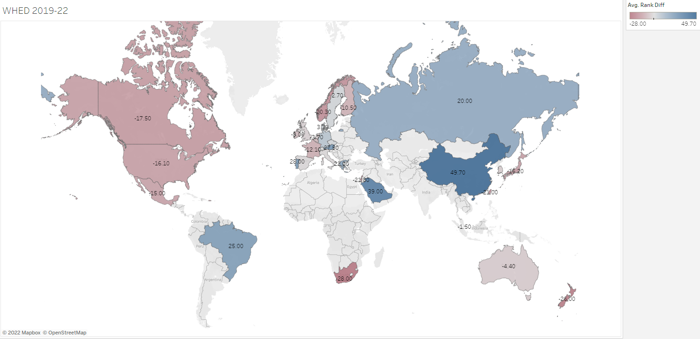

# WHE Distribution

## What is WHE Distribution?
The analysis of World higher-level education (WHE) distribution. 
To be more specific, it is the analysis of rankings and ranking differences among universities around the globe.

## What are the problems?
* What datasets is the eligible one to use?
  - CWUR world ranking lists
    - Sources: [CWUR 2022-23 Rankings](https://cwur.org/2022-23.php), [CWUR 2019-20 Rankings](https://cwur.org/2019-20.php)
    - It is one of the largest authorities in the field
    - The data provided by CWUR is one of the most geographically well-rounded
* How to effectively visualize the analyzed data? 
  - Using Tableau to map the data geographically
  - Building an interactive websites for dynamic visualization according to viewers' needs
* ***What can we learn from this?***
  - What insights can we get from this analysis?
  - What strategies can be derived for high school graduates who want to pursue higher level education internationally?

## Preparing the data
* Collect datasets from CWUR websites
  - Building a Python scraping tool to crawl the ranking data from CWUR websites
    - Convert the scrapped results to CSV files
    - Generate spreadsheets based on these files

## Processing the data
* Clean the blanked undocumented data instances
* Remove unwanted data types (columns)
* Filter out duplicated data instances
* Merge the 2022-23 and 2019-20 datasets

## Analysis
* Compute ranking differences between 2022-23 and 2019-20
* Summarize the ranking difference data into a separate dataset

## Visualization
* Display the rankings around the globe in year-scale (2022-23 and 2019-20 separately)
  - Top 100 (2019-20)
  - Top 300 (2019-20)
  - Top 100 (2022-23)
  - Top 300 (2022-23)
  To see the bar charts in this section, run the following under the App directory:
  <pre><code>streamlit app.py</code></pre>
* Display the ranking differences on the world map

## Insights
* For wider choices and better quality of higher level education, USA is still the to-go option.
* Otherwise, Europe countries (UK, France, Germany), Japan, and Canada are also decent choices since they all boast relatively large amount of top-ranked institutes and remain their advantages throughout the years (2019-2022).
* Another interesting factor here is China. Both of its Top-100 and Top-300 institutes are uprising throughout the years and have become a more worth-to-notice top-tier competitor around the globe.
